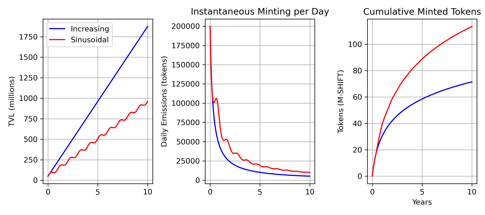

# TVL Emissions Mechanism

This document describes an mechanism that decreases emissions as Total Value Locked (TVL) increases, increases emissions if TVL falls (incentivizing recovery), and enforces a hard cap on total emissions.

---

## Requirements

1. Rewards should decrease as TVL grows.

2. Rewards should increase if TVL falls, encouraging new capital inflows during downturns.

3. Emissions must never exceed a strict cap, set to 2.5B tokens.

4. The formula should handle TVL going up and down gracefully without overshooting the cap.

5. Emissions should always be based on current conditions. Past epochs’ emissions are final.

---

## Mechanism Outline

We define:

- $C$ = **hard cap** on total tokens to ever be minted (2,500,000,000).
- $M(t)$ = total tokens minted up to the start of epoch $t$.
- $\text{TVL}(t)$ = the total value locked in epoch $t$.
- $\Delta_{\text{max}}$ = a **scaling parameter** that sets the maximum possible emission per epoch.
- $\alpha$ = a **tuning parameter** that controls how strongly the emission is reduced as TVL grows.

### Per‐Epoch Emission Calculation

1. **Inverse to TVL**  
   Define an inverse‐proportional factor:

   $$
   f\bigl(\text{TVL}(t)\bigr) =
   \frac{1}{\,1 + \alpha \,\text{TVL}(t)\,}
   $$

   When TVL is high, $f(\text{TVL}(t))$ is small, reducing emissions. When TVL is low, $f(\text{TVL}(t))$ is larger, providing a boost.

   

2. **Cap Remaining**  
   Define a fraction that represents how much of the hard cap is still available:

   $$
   g\bigl(M(t)\bigr) =
   1 - \frac{M(t)}{C}.
   $$

   As the protocol mints more tokens and $M(t)$ approaches $C$, this fraction shrinks. Thus emissions gradually taper off as you near the total cap.

   

3. **Combine Them**  
   Multiply these terms by a maximum “base rate” $\Delta_{\text{max}}$.  

   $$
   E(t) =
   \Delta_{\text{max}}
   \times
   \underbrace{g\bigl(M(t)\bigr)}_{\text{cap remaining}}
   \times
   \underbrace{f\bigl(\text{TVL}(t)\bigr)}_{\text{inverse TVL}}.
   $$

   This yields a “provisional” number of tokens to mint in epoch $t$

   

4. **Hard‐Cap Enforcement**  
   Apply a final check to ensure you never exceed $C$. If there aren’t enough tokens left in the cap, mint only up to the cap:

   $$
   E_{\text{actual}}(t) =
   \min\!\bigl(\,E(t),\;C - M(t)\bigr).
   $$

5. **Update Minted So Far**  

   $$
   M(t+1) =
   M(t) + E_{\text{actual}}(t).
   $$

   This completes the epoch. Subsequent epochs will have updated $M(t+1)$ and possibly a new TVL measurement.

### Properties

- **Inverse Relationship with TVL**  
  The term $\frac{1}{1 + \alpha\,\text{TVL}(t)}$ decreases as TVL increases.
  
- **Recovery Incentives**  
  If TVL dips, that same factor becomes larger, giving a temporary boost in emissions.
  
- **Strict Cap**  
  The check $\min(\cdot)$ with $C - M(t)$ ensures you never exceed 2.5B total minted.

---

## Calibrating $\alpha$ for a Non‐Zero Starting TVL

If the protocol launches with a starting TVL of $\text{TVL}(0) = T_0$ (e.g. 50M) and we want the emission in the first epoch to be a specific value $E_0$, we can solve for $\alpha$ directly. Suppose at $t = 0$, we have:

- $M(0) = 0$  (no tokens minted yet)
- $\text{TVL}(0) = T_0$
- Desired emission $= E_0$

We know from the emission formula (disregarding the cap check for this initial calibration, since $M(0)=0$):

$$
E(0) =
\Delta_{\text{max}}
\times
\bigl(1 - \tfrac{0}{C}\bigr)
\times
\frac{1}{1 + \alpha\,T_0}
= 
\Delta_{\text{max}} 
\times
\frac{1}{\,1 + \alpha\,T_0\,}
=
E_0.
$$

Rearrange to solve for $\alpha$:

$$
\alpha =
\frac{1}{T_0}
\left(
\frac{\Delta_{\text{max}}}{E_0}
- 1
\right).
$$

### Example

- Suppose $T_0 = 50$M, $\Delta_{\text{max}} = 10{,}000$ tokens per epoch, and we want an initial emission $E_0 = 2{,}000$ tokens.

  Then:

  $$
  \frac{\Delta_{\text{max}}}{E_0}
  = 
  \frac{10{,}000}{2{,}000}
  = 
  5
  \quad\Longrightarrow\quad
  \Bigl(\frac{\Delta_{\text{max}}}{E_0} - 1\Bigr) 
  = 
  4.
  $$

  Hence:

  $$
  \alpha 
  = 
  \frac{1}{50}
  \times
  4
  = 
  0.08
  $$

  (units inversely matching the TVL units).
  
- With that $\alpha$, the formula yields exactly 2,000 tokens at 50M TVL for the first epoch. After that, if TVL fluctuates or minted supply accumulates, the emission automatically adjusts.
